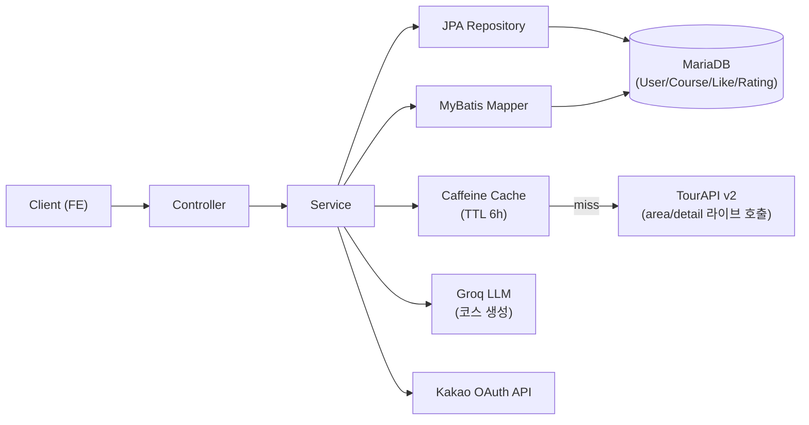
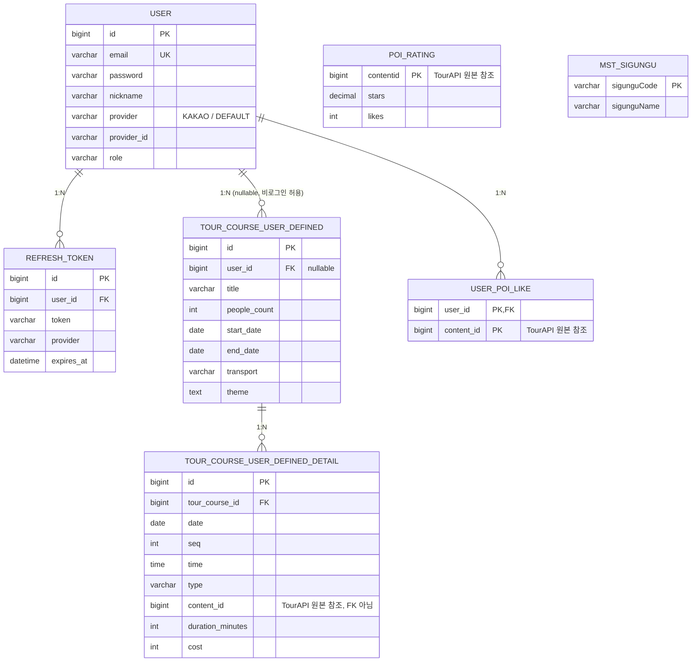
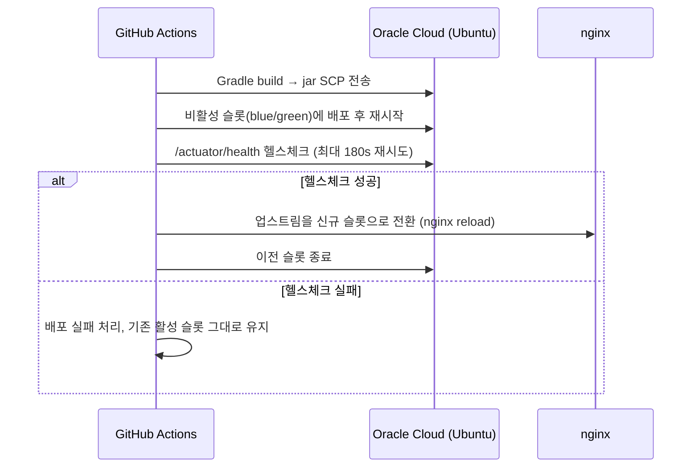

# 경북 CoCo — Backend

경북 지역 관광 정보를 바탕으로, 사용자 조건(인원·기간·테마·이동수단)에 맞는 여행 코스를 **AI(Groq LLM)가 자동으로 생성**해주는 여행 플래너 서비스의 백엔드입니다.

- 공모전 출품작으로, **관광 정보를 로컬 DB에 적재할 수 없다는 규정** 때문에 한국관광공사 TourAPI를 매 요청 라이브로 호출하고 캐시로 보완하는 구조를 채택했습니다.
- 프론트엔드: https://github.com/UsoD98/Gyeongbuk-CoCo

## 목차

- [기술 스택](#기술-스택)
- [아키텍처](#아키텍처)
- [프로젝트 구조](#프로젝트-구조)
- [DB 구조](#db-구조)
- [핵심 기능](#핵심-기능)
- [문제 해결 히스토리](#문제-해결-히스토리)
- [배포](#배포)
- [실행 방법](#실행-방법)

## 기술 스택

| 구분 | 내용 |
| --- | --- |
| Language / Runtime | Java 25 |
| Framework | Spring Boot 4.0 (Web, Security, Validation, Actuator, Cache) |
| 영속성 | Spring Data JPA(Hibernate) + MyBatis 혼용, MariaDB |
| 인증 | JWT(jjwt) Stateless 인증, 카카오 OAuth |
| AI | Groq API (`openai/gpt-oss-20b`) — 코스 생성 |
| 캐시 | Caffeine (in-process, TTL 6h) |
| 외부 연동 | 한국관광공사 TourAPI v2 |
| CI/CD | GitHub Actions → systemd + nginx Blue/Green 무중단 배포 (Oracle Cloud) |
| 테스트 | JUnit5, Mockito, `@WebMvcTest` 슬라이스 테스트 |

## 아키텍처

일반적인 계층형 구조를 따르되, **관광 원본 데이터는 DB에 저장하지 않는다**는 공모전 규정이 전체 설계를 관통합니다. Controller → Service 사이는 DTO로만 오가며 Entity를 외부에 노출하지 않습니다.



- **인증**: JWT Stateless — AccessToken(15분) + RefreshToken(7일, DB 저장·로테이션). `JwtAuthenticationFilter`가 모든 요청의 Bearer 토큰을 검증.
- **관광 데이터**: 로컬 DB 미보관 — `TourApiClient`가 요청 시점에 TourAPI를 라이브 호출하고, Caffeine 캐시(지역 후보 리스트·POI 상세, TTL 6h)로 응답 속도와 API 호출한도를 보호. 배포 직후에는 `PoiCacheWarmupScheduler`가 캐시를 미리 채워 콜드스타트를 방지.
- **앱 자체 데이터만 DB 보관**: 회원, 좋아요/별점(`poi_rating`), 사용자가 저장한 코스만 MariaDB에 영속화.
- **배포**: GitHub Actions가 빌드·전송 후, nginx 리버스 프록시 뒤에서 blue/green 두 systemd 슬롯을 번갈아 기동해 무중단으로 전환.

## 프로젝트 구조

```
com.eodegano.cocobackend/
├── controller/    REST 엔드포인트 (Auth, User, Poi, TourCourse)
├── service/       비즈니스 로직 (인터페이스 + Impl 분리)
├── domain/        JPA 엔티티
├── dto/           요청/응답 DTO
├── repository/    JPA Repository
├── client/        외부 API 클라이언트 (Groq, Kakao)
├── dataMig/       TourAPI 라이브 연동 클라이언트 (TourApiClient)
├── security/      JWT 필터·Provider·인증 예외 핸들러
├── config/        Security, Caffeine 캐시 설정
├── exception/     전역 예외 처리 (GlobalExceptionHandler)
└── util/
```

## DB 구조

관광 원본 데이터를 담는 테이블이 없다는 점이 스키마의 특징입니다. 모든 콘텐츠 정보(장소명·이미지·요금 등)는 `content_id`로 TourAPI를 가리키기만 하며, JPA 연관관계도 맺지 않습니다.



`poi_rating`은 앱 안에서 자체 생산되는 좋아요·별점만 담는 테이블로, 관광 원본 테이블과 달리 유일하게 `content_id` 기준 부가 데이터를 영속화합니다. `mst_theme`도 `mst_sigungu`와 동일한 구조의 기준정보 테이블입니다.

## 핵심 기능

### 1. 인증/인가 — 로컬 로그인 + 카카오 OAuth 통합

- JWT Stateless 인증. AccessToken/RefreshToken 발급, RefreshToken은 재발급 시마다 폐기 후 재발급(로테이션)해 탈취 위험을 줄임.
- 카카오 OAuth 콜백에서 **동일 이메일의 기존 로컬 계정을 자동으로 연결**하되, 이메일 검증 여부를 확인해 "이메일 미인증 카카오 계정으로 남의 로컬 계정을 탈취"하는 취약점을 차단(v0.8.0).
- `User.provider` 값을 `KAKAO`/`DEFAULT`로 명시화하고 JWT에 `provider` 클레임을 추가해, FE가 로그인 수단을 판별할 수 있게 함(v0.8.7).
- 회원 정보 조회 API에 소유권 검증을 추가해 다른 사용자 정보를 조회할 수 있던 IDOR 취약점 수정(v0.8.1).

### 2. AI 여행 코스 생성 — 핵심 차별점

인원·기간·이동수단·테마·시군구를 입력받아 Day별 일정을 자동 생성합니다.

1. **후보 샘플링**: TourAPI 라이브 후보 중 `poi_rating.stars`/`likes` 기반으로 Tier A(고평점 70%)/Tier B(중·저평점·평가없음 30%) 확률적 샘플링.
2. **지리적 클러스터링**: 이동수단별 반경(자차 60km/대중교통 25km)으로 Haversine 거리 기반 클러스터링 후, AI에는 좌표 대신 클러스터 번호만 전달 — 토큰을 아끼면서 소형 모델이 "같은 클러스터끼리 묶기"만 하도록 유도.
3. **Groq LLM 호출**로 Day별 일정 생성 → 응답의 `contentId`·날짜·타입을 후보 리스트와 대조 검증 → 같은 날 연속 방문지 간 실제 좌표 거리도 재검증.
4. 검증 통과 시 `TourCourseUserDefined` + `TourCourseUserDefinedDetail`로 저장. 비로그인 사용자도 생성 가능(이후 로그인 시 소유권 이전).

Groq 호출 실패·응답 파싱 실패·검증 실패는 표준 400/500과 구분되는 **전용 HTTP 499**로 응답해, FE가 "AI 생성 실패"를 별도 UX로 처리할 수 있게 설계했습니다.

### 3. POI 큐레이션 — TourAPI 라이브 연동 + 캐시

- 로컬 DB 저장 없이 TourAPI를 매 요청 호출하되, Caffeine 캐시(TTL 6h)로 응답 속도와 호출한도를 보호.
- 콘텐츠 타입별로 분리·병렬 수집해, 물량이 큰 타입이 소형 타입 후보를 밀어내던 문제를 해소.
- 배포(Blue/Green 전환) 직후 캐시가 비는 콜드스타트를 스케줄러로 미리 예방.
- 목록/상세 조회에 좋아요 여부·총 좋아요 수·별점을 함께 반환.

### 4. 코스 관리 & 좋아요 & 공유

- 저장 코스 CRUD(목록/상세/제목 수정/일정 전체 수정/삭제), 소유권 검증.
- 좋아요는 원자적 UPDATE(JPQL)로 증감해 동시 요청에도 카운트 유실 없이 처리.
- 공유는 별도 토큰·스냅샷 저장 없이 `courseId` 기반 읽기 전용 공개 뷰로 단순화(공유 시점 이후 원본이 수정돼도 항상 최신 상태를 보여줌).

## 문제 해결 히스토리

개발 중 실제로 겪은 문제와 대응을 시간순으로 정리했습니다.

| 버전 | 문제 | 해결 |
| --- | --- | --- |
| v0.5.0 | 공모전 규정상 관광 정보를 로컬 DB에 적재할 수 없음이 뒤늦게 확인됨 | 배치 적재 구조를 전면 폐기, TourAPI 라이브 호출 + Caffeine 캐시 구조로 재설계 |
| v0.5.6 | `AccessDeniedException`이 403이 아닌 500으로 응답 | 전역 예외 핸들러에 Security 예외 매핑 추가 |
| v0.5.8 | 콘텐츠 타입 미분리 단일 호출로 대형 타입이 소형 타입 후보를 밀어냄 | 타입별 분리·병렬 수집(가상 스레드) + 캐시 워밍 도입 |
| v0.5.11 | 좋아요 저장 시 벌크 업데이트의 `clearAutomatically`로 인해 신규 INSERT가 유실 | 원자적 JPQL UPDATE로 전환 |
| v0.5.12 / v0.6.0 | Groq 모델 단종, 이후 reasoning 모델 특성상 추론 토큰이 응답 본문을 소진해 파싱 실패 | 모델 교체 + `reasoning_effort`/`reasoning_format` 옵션으로 추론 토큰 분리, 진단 로깅 추가 |
| v0.6.1 | AI 생성 실패가 일반 400/500과 뒤섞여 FE가 원인별 대응 불가 | 전용 `AiCourseGenerationException` → HTTP 499 + 에러코드 체계 설계 |
| v0.6.8 | 소형 AI 모델이 좌표 없이 이동거리를 추측해 비현실적인 동선 생성 | Haversine 기반 지리적 클러스터링 + 사후 거리 재검증 안전장치 추가 |
| v0.6.10 | 단일 재시작 배포라 배포마다 API 다운타임 발생 | nginx + systemd Blue/Green 무중단 배포로 전환 |
| v0.8.0 | 이메일 미인증 카카오 계정으로 동일 이메일 로컬 계정을 자동 연결·탈취 가능 | 이메일 검증 여부를 확인 후에만 계정 연결하도록 수정 |
| v0.8.1 | 회원 정보 조회 API에 소유권 검증 누락(IDOR) | 요청자·대상 사용자 일치 여부 검증 추가 |
| v0.8.3/0.8.4 | 회원 탈퇴를 하드 딜리트로 전환하며 연관 테이블(`refresh_token`, `user_poi_like`) FK 위반 발생 | 연관 데이터 선삭제 후 본체 삭제하도록 순서 수정 |
| v0.8.5 | TourAPI 무응답 시 요청이 무한 대기하다 504로 실패 | 타임아웃 설정 + 장애 응답코드를 503에서 424(Failed Dependency)로 명확화 |

## 배포

GitHub Actions가 `main` 브랜치 push 시 빌드부터 무중단 전환까지 자동 수행합니다.



## 실행 방법

```bash
# .env 파일 준비 (DB_HOST, DB_PORT, DB_NAME, DB_USERNAME, DB_PASSWORD,
# JWT_SECRET, TOURAPI_SERVICE_KEY, GROQ_API_KEY)

./gradlew bootRun          # 애플리케이션 실행
./gradlew test             # 전체 테스트 실행
```
